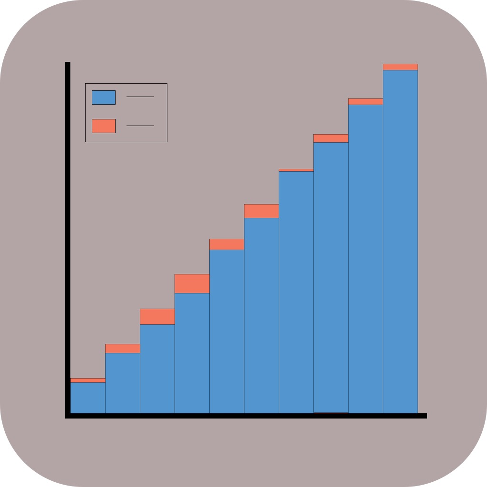

[](https://github.com/marcoromanelli-github/ReliabilityDiagrams/actions)
[](https://img.shields.io/badge/Documentation-yes-blue)
[](https://img.shields.io/badge/License-MIT-yellow.svg)

# ReliabilityDiagrams
Create reliability diagrams to quantify ML calibration.

<div align="center">
    
</div>

Package that can be used to create reliability diagrams according to the 
definition in the paper 
[On Calibration of Modern Neural Networks](https://arxiv.org/pdf/1706.04599.pdf).
It also computes the Expected Calibration Error (ECE).

### Intallation
1. Install required packages by running
```console
foo@bar:~$ python -m pip install -U -r <path>/requirements.txt
```
2. Download the deplyed package as the artifact created by the last action in [Actions](https://github.com/marcoromanelli-github/ReliabilityDiagrams/actions) and unzip it.
3. Run the command below
```console
foo@bar:~$ python -m pip install -U <path>/built_pkg/<filename>.whl
```  

### Current package structure
```
Package
├── LICENSE
├── README.md
├── ReliabilityDiagrams
│   ├── compute_quantities.py
│   └── plot_reliability_diagram.py
├── ReliabilityDiagrams_test
│   └── test_0.py
├── requirements.txt
├── setup.py
└── toy_data
    ├── y_pred.pkl
    └── y_true.pkl
```

### How to
The folder [RealiabilityDiagrams_test](https://github.com/marcoromanelli-github/ReliabilityDiagrams/tree/master/ReliabilityDiagrams_test) contains examples which are useful to understand how to use the library. Let us create a file try_test.py as below

```python
from ReliabilityDiagrams_test import test_0

def run_test():
    test_0.test_0()


if __name__ == '__main__':
    run_test()
```

Supposing this command is launched from the CLI as
```console
foo@bar:~$ python try_test.py
```
produces the plot


   
